<div align="center">

# Streamhouse Violence Detection

### Real-time violence detection and large-scale video analytics on a **Streamhouse** data platform

**Apache Fluss · Paimon · Iceberg** on **Flink** — with **StreamViD-A**, a causal two-stream deep-learning model, and a Vietnamese **Agentic RAG** analyst


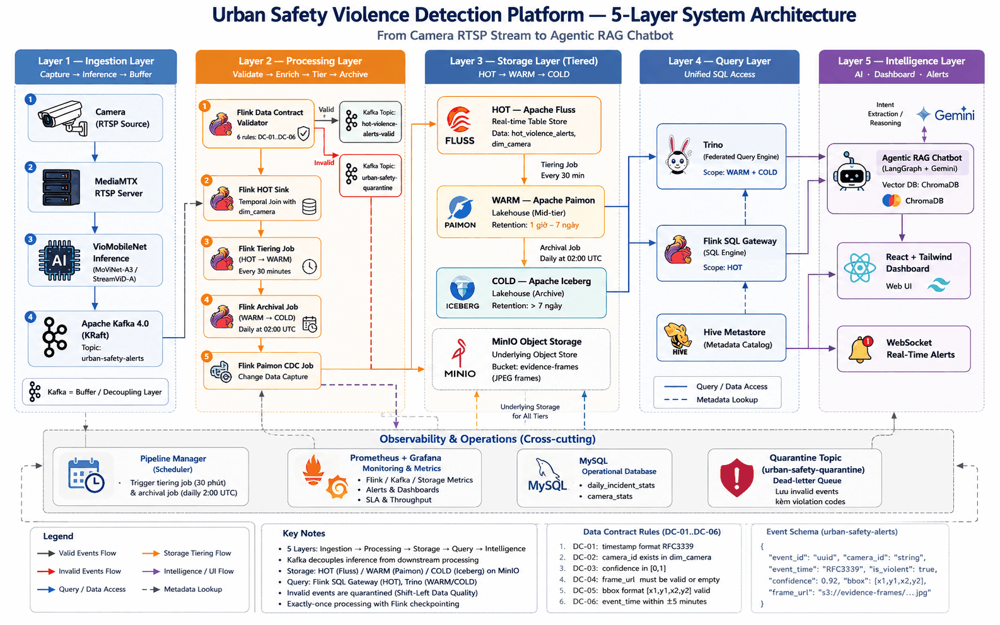

</div>

> Graduation thesis, Faculty of Information Technology, **HCMC University of Technology and Education (HCMUTE)**, June 2026.
> *"Optimizing the ELT pipeline and deep-learning model on a Lakehouse architecture for large-scale violent-video analytics."*

---

## Highlights

| | Result | Measured on |
|---|---|---|
| **HOT query latency** | **~100 ms** (target < 100 ms) — Apache Fluss | GCP `e2-standard-4`, no GPU |
| **WARM query latency** | **5.9 s** (target < 10 s) — Paimon via Trino | same |
| **COLD query latency** | **9.5 s** (target < 30 s) — Iceberg via Trino | same |
| **WARM speed-up** | **14–23×** vs. querying Paimon through Flink SQL Gateway (3–5 min → 5.9–13 s), by building the `paimon-trino-440` connector from source | same |
| **vs. Medallion** | HOT path **~300×** faster than a ~30 s micro-batch Bronze→Silver→Gold hop, with each record stored once instead of three times | same |
| **Exactly-once** | **100 / 100** records correct (none lost, none duplicated) under Flink failure injection | same |
| **Data contract** | 6 shift-left rules; **97.1 %** of events valid, **2.9 %** quarantined before they reach storage | 15-camera stream |
| **Model accuracy** | **StreamViD-A: 82.5 % accuracy, 0.903 AUC-ROC** — highest AUC of 46 experiments; **+15 pts** over I3D and ResNet50+LSTM | 378-clip balanced test set |
| **Model efficiency** | Only **252 K trainable** of 8.54 M parameters; ~190 MB VRAM per stream → **~70 concurrent cameras on one 16 GB RTX A4000** | NVIDIA A4000 |
| **Sessionization** | A 30 s session window cuts the records to process by **97.6 %** | Flink job |
| **Footprint** | Whole data platform in **~8.5 GB RAM**; **22 / 23** end-to-end test cases passed | GCP VM |

All figures come from the thesis experiments (Chapter 4). The 15 cameras are simulated RTSP feeds built from public datasets (see [Limitations](#limitations--future-work)).

---

## Why Streamhouse?

Classic Lakehouse stacks (Lambda, Medallion) copy every event through Bronze → Silver → Gold, which adds latency and storage duplication. A **Streamhouse** keeps the *streaming* store and the *lake* in one design: data is **written once** into a real-time table and **tiered automatically** into the lake, while one SQL engine queries every tier.

<div align="center">
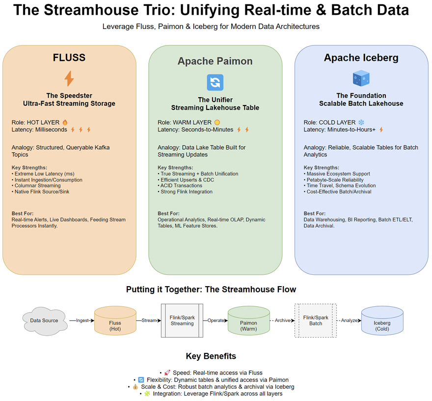
</div>

| Tier | Engine | Data age | Latency (measured) | Role |
|------|--------|----------|--------------------|------|
| 🔥 **HOT** | **Apache Fluss** | < 1 h | ~100 ms | Real-time columnar table store; live alerts and the command center |
| 🟠 **WARM** | **Apache Paimon** | 1 h – 7 d | 5.9 s | LSM-tree lakehouse table, ACID, CDC; analytics and aggregations |
| 🧊 **COLD** | **Apache Iceberg** | > 7 d | 9.5 s | Parquet archive with time-travel for audits and history |

A **Pipeline Manager** supervises everything: it initialises schemas, seeds the camera dimension, submits and watches the Flink jobs, tiers HOT → WARM every 30 minutes and archives WARM → COLD daily at 02:00 UTC.

## Architecture

```
Camera (RTSP) ─► MediaMTX ─► StreamViD-A inference ─► Kafka (urban-safety-alerts)
                                                          │
                                  Flink: Data Contract Validator (DC-01 … DC-06)
                                     ├─ valid ───► Fluss  HOT  ─(tier 30 min)─► Paimon WARM ─(daily)─► Iceberg COLD
                                     └─ invalid ─► quarantine topic (dead-letter)
                                                          │
                              Trino (federated SQL over Paimon + Iceberg) · Flink SQL Gateway (Fluss)
                                                          │
                        Agentic RAG chatbot (LangGraph · Gemini · ChromaDB) ─► React command-center dashboard
```

<div align="center">
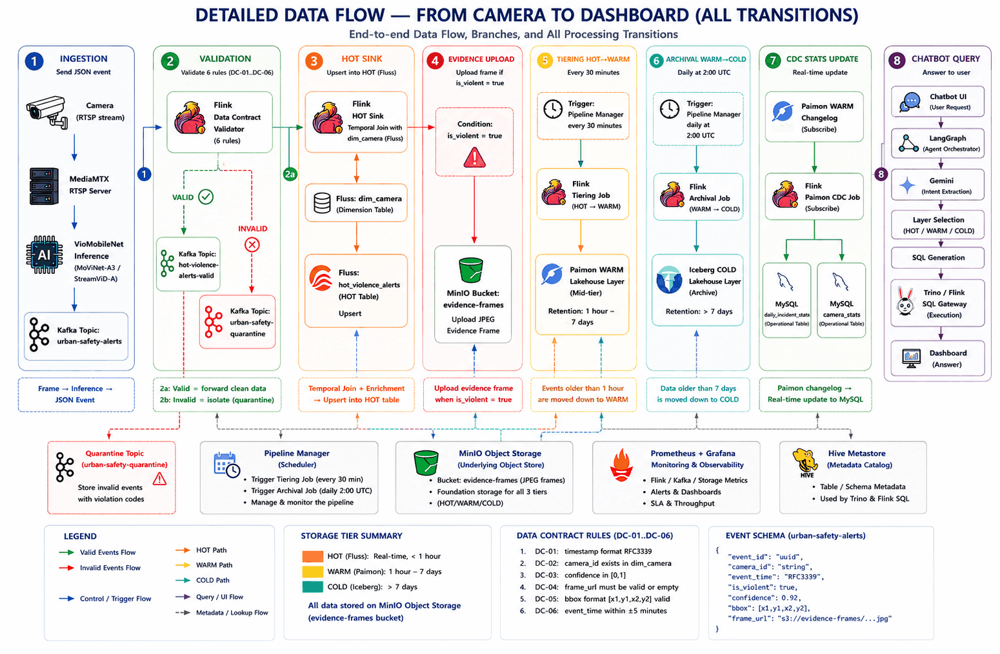
</div>

**Design decisions worth knowing**

- **Shift-left data quality.** Six data-contract rules (DC-01…DC-06: schema, nulls, value ranges, freshness, de-duplication, camera whitelist) run inside Flink; bad events go to a quarantine topic and never touch storage.
- **Exactly-once end to end.** Flink checkpointing (30 s) plus transactional Paimon/Iceberg commits; verified by killing the job mid-stream.
- **Star schema in the WARM layer.** `fact_violence_incident` joined to `dim_camera`, `dim_date`, `dim_time`, `dim_event_type`.
- **Evidence frames** (JPEG with bounding boxes) are stored in MinIO and linked from incident rows, so every alert can be backed by an image.

<details>
<summary><b>More diagrams</b> — shift-left validation, star schema, pipeline manager, hybrid deployment</summary>

<br>

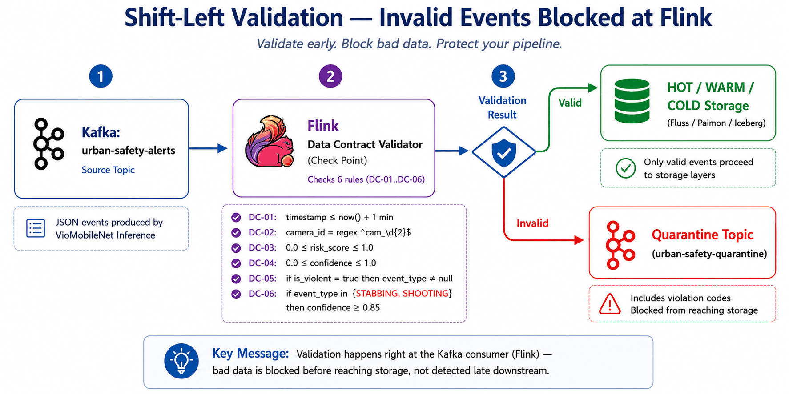
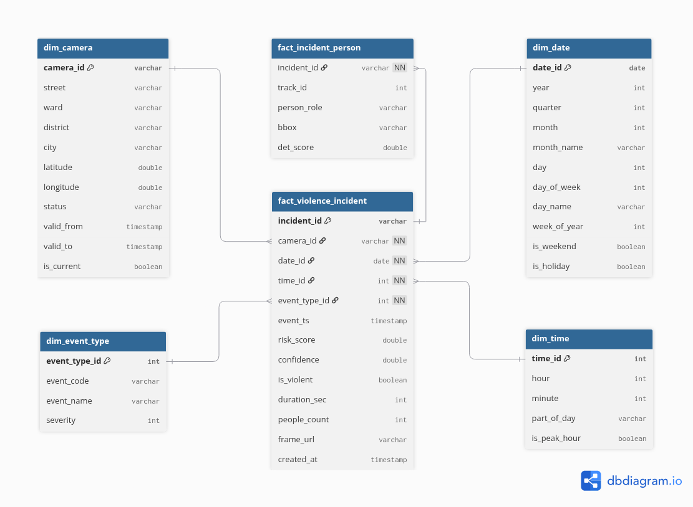
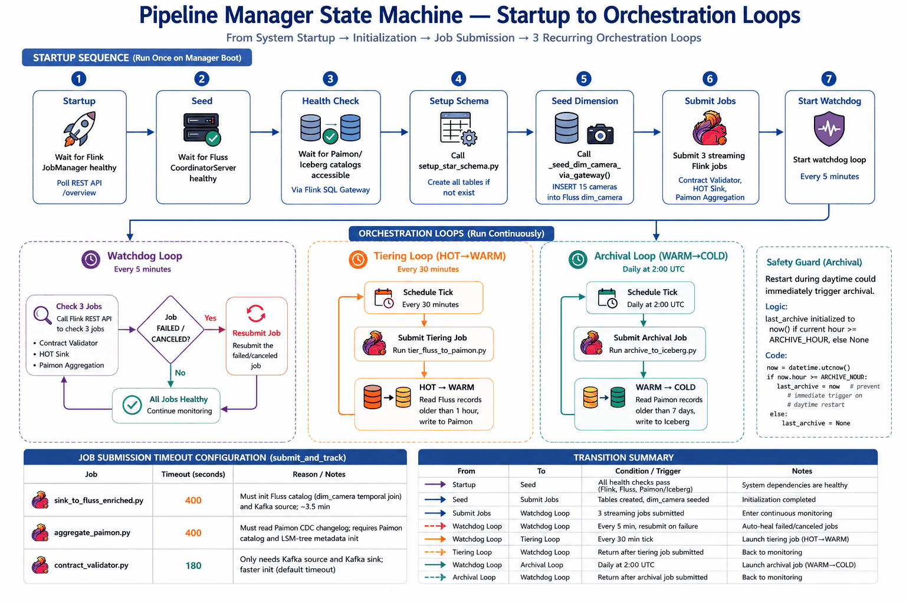
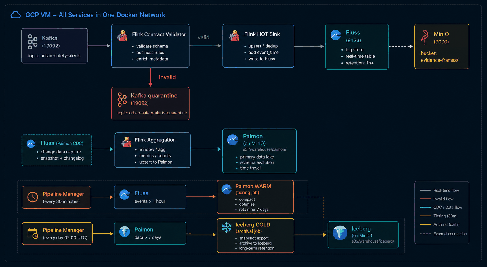

</details>

---

## AI model — StreamViD-A

Violence detection has to run on **endless RTSP streams**, so the model must be **temporal**, **causal** (past frames only) and **light enough to share one GPU across dozens of cameras**. StreamViD-A is a *causal two-stream* network built on that constraint:

- **Appearance stream** — a **frozen MoViNet-A3** (Kinetics-600 pre-trained, 744-d features) that keeps constant per-stream memory through streaming "external states".
- **Motion stream** — **CausalFrameDiff** (difference of consecutive frames — no optical flow) → small 2D CNN encoder → **causal temporal attention** (4 heads, lower-triangular mask).
- **Head** — concatenated 808-d vector → `Dense(256)` → `Dropout(0.3)` → softmax (Fight / No-Fight).

Only **252,130 of 8,540,116** parameters are trained (≈ 3 %).

<div align="center">
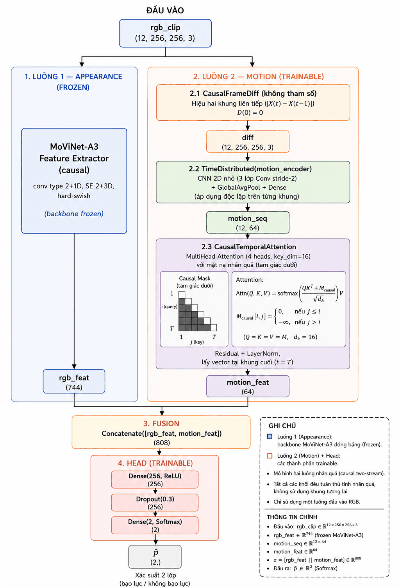
</div>

Trained on a merged three-source dataset — **RWF-2000 + VioPeru + SCFD, 2,556 clips** — across **46 experiments**. Evaluated on a balanced 378-clip test set:

| Model | Test Acc | F1 (macro) | AUC-ROC |
|-------|:-------:|:----------:|:-------:|
| **StreamViD-A (`sva_03`, deployed)** | **0.8254** | **0.8254** | **0.9029** |
| MoViNet-A3 (fine-tuned) | 0.8122 | 0.8116 | — |
| MoViNet-A2 | 0.7937 | 0.7699 | 0.7698 |
| MoViNet-A1 | 0.7778 | 0.8067 | 0.8069 |
| ResNet50 + LSTM | 0.6746 | 0.6746 | 0.7367 |
| I3D | 0.6720 | 0.6715 | 0.7290 |

The best-accuracy variant (A3 + light augmentation) reaches **0.8439**; `sva_03` was chosen for deployment because it has the best AUC-ROC (the most reliable score ranking for threshold-based alerting).

<div align="center">
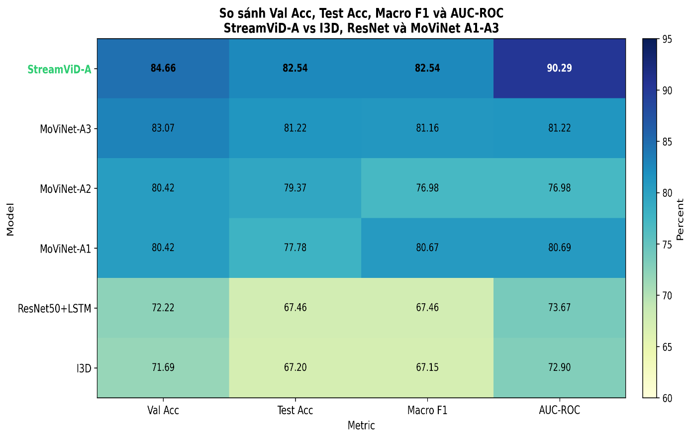
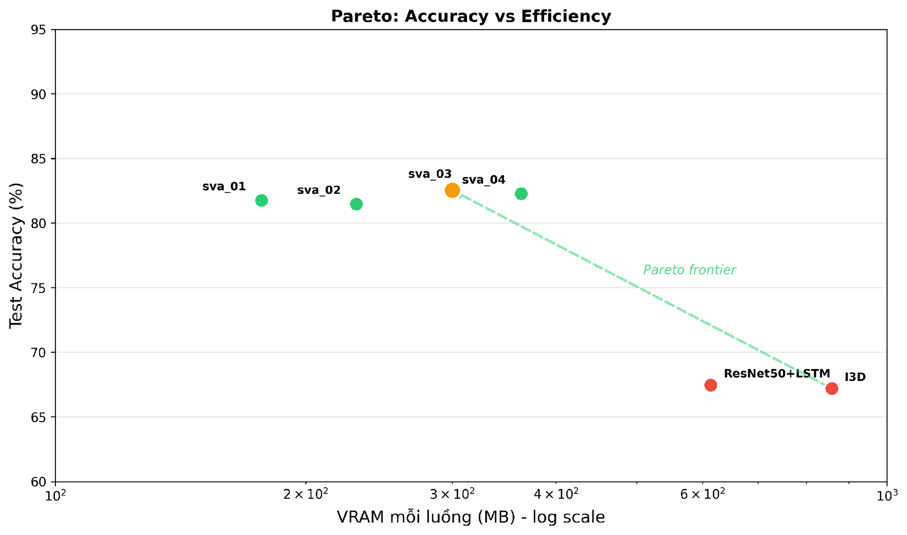
</div>

> **Scope note.** This repository contains the **data platform, pipelines, chatbot and deployment** code. The model is trained and served on a separate GPU node (`deploy/viomovinet/` has its compose file and Kafka bridge). The default streaming profile here uses `rtsp_inference_mock.py` — a drop-in placeholder with the same event schema — so the whole platform can be reproduced without a GPU.

---

## Agentic RAG analyst (Vietnamese)

Operators ask questions in plain Vietnamese; a **LangGraph** agent turns them into SQL on the *right* tier and answers with citations.

<div align="center">
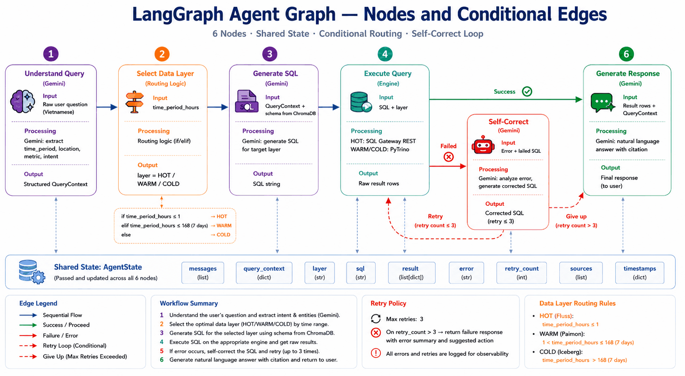
</div>

- **Layer routing** from the time range in the question: < 1 h → Fluss, 1 h – 7 d → Paimon, > 7 d → Iceberg.
- **Text-to-SQL** with Gemini 2.0 Flash, grounded in schema metadata retrieved from **ChromaDB** (no invented tables or columns).
- **Self-correction**: failed SQL is repaired and retried up to 3 times; if it still fails the user is told why.
- **Evidence retrieval**: asks like *"show me the latest incident photo"* return the stored frames.

```bash
curl -X POST http://localhost:5002/chat -H "Content-Type: application/json" \
  -d '{"query": "Trong 30 phút qua có bao nhiêu vụ bạo lực?"}'      # → HOT  (Fluss)
```

## Dashboard & observability

The React dashboard lives in the [`Violence-Urban-Safety-UI`](https://github.com/minhnhat1206/Violence-Urban-Safety-UI) submodule (Command Center, Live Streams, Alerts, Analytics, Vigilance Terminal chatbot). Grafana covers pipeline health and per-tier latency.

<div align="center">


</div>

---

## Quick start

**Requirements:** Docker 24+ (Compose v2), ~12 GB RAM for containers, ~30 GB disk, a free [Gemini API key](https://aistudio.google.com/app/apikey). Optional: the [RWF-2000](https://github.com/mchengny/RWF2000-Video-Database-for-Violence-Detection) videos for the RTSP simulator (`data/raw/RWF-2000/`).

```bash
git clone --recurse-submodules https://github.com/minhnhat1206/streamhouse-violence-detection.git
cd streamhouse-violence-detection

cp docker/.env.example docker/.env          # set GEMINI_API_KEY and change the default passwords
docker network create violence-detection-net

# Core platform + RTSP simulator + Flink SQL Gateway (needed for HOT queries and dimension seeding)
docker compose -f docker/docker-compose.yml --profile streaming --profile gateway up -d

docker logs -f pipeline-manager             # first start takes ~5 min while catalogs initialise and Flink jobs are submitted
```

Then open the Flink UI (`:8081`), MinIO (`:9001`), the chatbot Swagger (`:5002/docs`), or start the dashboard:

```bash
cd Violence-Urban-Safety-UI/frontend && npm install && npm run dev
```

### Compose profiles

| Profile | Adds | Purpose |
|---------|------|---------|
| *(default)* | Kafka, MinIO, Flink, Fluss, MySQL, Hive Metastore, Trino, chatbot, pipeline-manager, frame-extractor | Core platform |
| `streaming` | MediaMTX, `rtsp_pusher`, `rtsp-inference-mock` | Simulated 15-camera RTSP feed |
| `gateway` | Flink SQL Gateway | HOT (Fluss) queries, `dim_camera` seeding |
| `monitoring` | Prometheus, Grafana, node-exporter | Dashboards |
| `ui` | Kafka UI | Browse topics |
| `scaling` | 2 Trino workers | Faster federated queries |
| `admin` | Admin API | Operations helpers |

### Ports

| Service | Port | | Service | Port |
|---|---|---|---|---|
| Flink UI | 8081 | | Chatbot API | 5002 |
| Trino | 8082 | | Grafana | 3001 |
| MinIO console / S3 | 9001 / 9000 | | Prometheus | 9090 |
| Kafka (host) | 19092 | | MediaMTX (RTSP) | 8554 |
| Fluss coordinator | 9123 | | Kafka UI | 18085 |

### Verify

```bash
curl http://localhost:5002/health
curl http://localhost:5002/api/layer-counts     # rows per tier (WARM fills after the first 30-min tiering run)
curl http://localhost:5002/api/latency          # per-tier query latency
```

### Stop the simulators gracefully

`rtsp-inference-mock` and `rtsp_pusher` loop forever. Stop them before shutting the stack down:

```bash
docker exec rtsp-inference-mock touch /app/tmp/STOP
docker exec rtsp_pusher touch /app/tmp/STOP
docker compose -f docker/docker-compose.yml down        # add -v to also delete data volumes
```

<details>
<summary><b>Troubleshooting</b></summary>

- **`network violence-detection-net not found`** → `docker network create violence-detection-net`.
- **No Flink jobs after start** → watch `docker logs pipeline-manager`; Fluss/Paimon catalog init takes 3–5 min on first boot.
- **WARM returns 0 rows** → Paimon is filled by tiering every 30 min; check `/api/layer-counts` (`hot > 0` first).
- **Fluss `COUNT(*)` is 0** → streaming aggregates only count new events; use `/api/layer-counts` for a reliable HOT count.
- **Out of memory** → every service has a memory/CPU limit; keep optional profiles off on a 16 GB machine.
</details>

## Repository layout

```
├── scripts/
│   ├── streaming/    # RTSP pusher and mock inference (same event schema as the real model)
│   ├── transform/    # Flink jobs: contract validator, Fluss sink, tiering, archival, aggregation, pipeline manager
│   ├── chatbot/      # FastAPI + LangGraph agent, Text-to-SQL, Trino client, evidence service
│   ├── admin/        # Operations API
│   └── setup/        # Kafka topic creation, federated-query demos
├── docker/           # docker-compose.yml, Dockerfiles, .env.example
├── config/           # Trino, Hive, MediaMTX, Prometheus, Grafana provisioning
├── deploy/           # GCP single-VM deployment, GPU inference node (viomovinet), nginx
├── docs/             # Technical documentation + figures
└── Violence-Urban-Safety-UI/   # React dashboard (git submodule)
```

## Documentation

> Most deep-dive documents are written in Vietnamese.

| Document | Topic |
|---|---|
| [Architecture](docs/architecture.md) | Streamhouse vs. Lambda/Medallion, flow diagrams |
| [Storage layers](docs/storage-layers.md) | HOT / WARM / COLD specs with SQL examples |
| [Data contracts](docs/data-contracts.md) | Validation rules and quarantine flow |
| [Flink architecture](docs/flink-architecture.md) · [Fluss guide](docs/fluss-guide.md) | Jobs, checkpointing, Fluss usage |
| [Agentic RAG](docs/agentic-rag.md) · [Chatbot API](docs/chatbot-api.md) | Agent design and endpoints |
| [Trino federation](docs/trino-query-federation.md) | Cross-tier queries, Paimon connector |
| [Evidence frames](docs/frame-evidence-storage.md) | MinIO layout and retrieval |
| [Streamhouse vs. traditional](docs/streamhouse-vs-traditional.md) | Comparison and trade-offs |

## Limitations & future work

- Evaluated mostly on **one node**; multi-node scaling is untested.
- Chatbot end-to-end latency is dominated by the external LLM (two Gemini calls); local LLMs or caching are the next step.
- Test video comes from public datasets and simulated RTSP feeds — more real-camera data is needed.
- Planned: WebSocket alert push, a lighter edge variant of StreamViD-A, multi-class violence types.

## Authors

| | |
|---|---|
| **Nguyễn Ngọc Minh Nhật** — [@minhnhat1206](https://github.com/minhnhat1206) | Streamhouse data platform (Flink, Fluss, Paimon, Iceberg, Trino), Agentic RAG chatbot, backend API, monitoring, Docker/GCP deployment, end-to-end testing |
| **Nguyễn Quốc Huy** — [@huy-dataguy](https://github.com/huy-dataguy) | StreamViD-A model (data, design, 46 training experiments, evaluation), React dashboard |

Advisor: **Dr. Nguyễn Thanh Tuấn**, Faculty of Information Technology, HCMUTE.

Built on open-source projects: Apache Flink, Kafka, Fluss, Paimon, Iceberg, Trino, MinIO, LangGraph, ChromaDB, MoViNet, MediaMTX. Training data: RWF-2000, VioPeru, SCFD.

See [CONTRIBUTING.md](CONTRIBUTING.md) for conventions.
